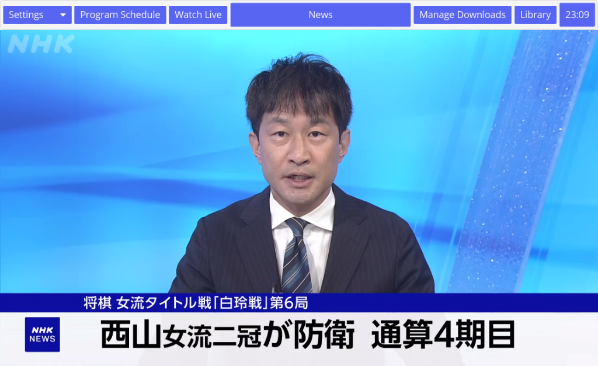
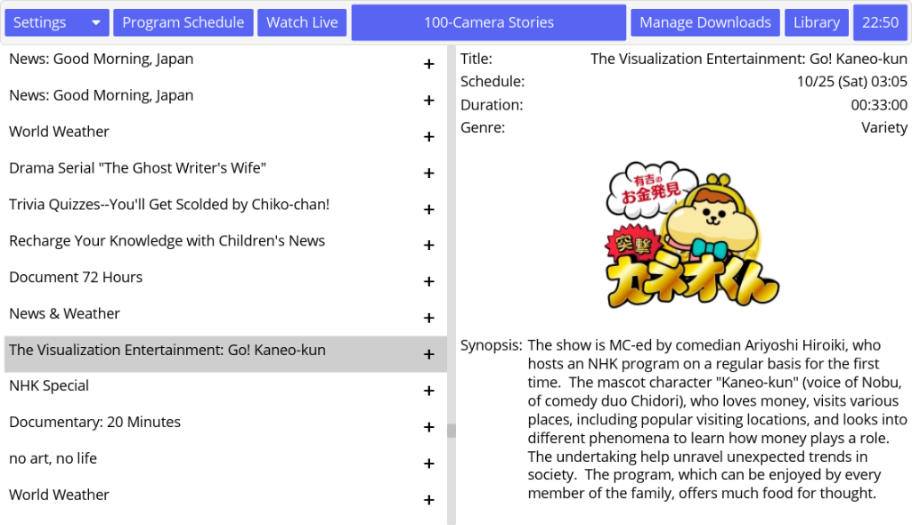

# N-Streamer
N-Streamer is a GUI streaming client build in rust using iced. It supports playing unencrypted web streams, and lets you schedule downloads and build a digital library of recorded content. It is build around "NHK World Premium", but works with any unencrypted HLS stream.

N-Stream does not bypass DRM or authentication. Using it may violate a provider's Terms of Service.

## Features
- play unencrypted web streams

  
- explore NHK World Premium's schedule

  

- download web streams
  - not yet implemented
- build a digital library
  - not yet implemented

